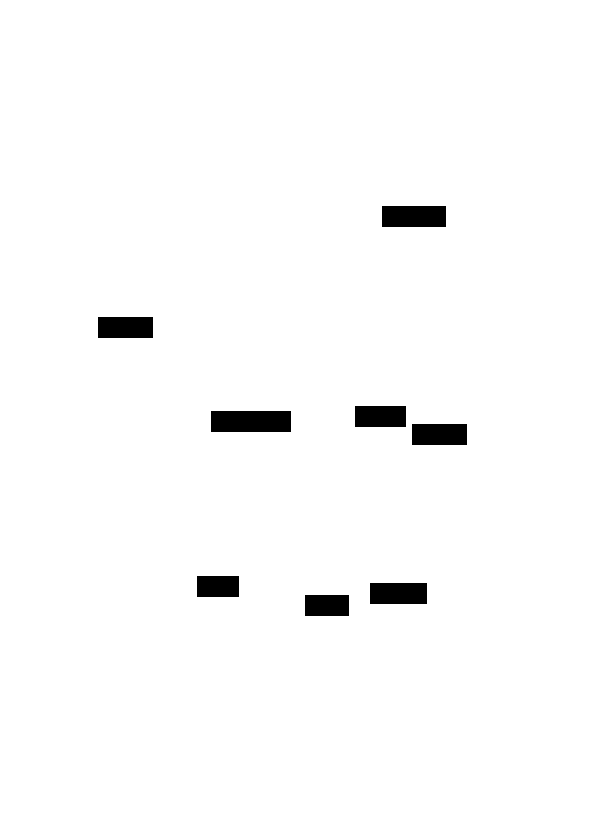

# Extending aldakit: A Programmatic API

This document explores extending aldakit beyond parsing the Alda language to provide a programmatic Python API for music composition. The key insight is that **the AST is the central hub** - all inputs flow into it, all outputs derive from it.

## Architecture Overview



**AST as the central hub** - symmetric operations:

| Input | Operation | Output | Operation |
|-------|-----------|--------|-----------|
| Alda Source | `parse()` | Alda Source | `export()` |
| MIDI File | `import()` | MIDI File | `save()` |
| Python API | `to_ast()` | MIDI Playback | `play()` |
| MIDI Input | `transcribe()` | | |

The programmatic API creates domain objects that can:

1. Generate AST nodes directly via `to_ast()` (for MIDI output)
2. Serialize to Alda source code via `to_alda()` (for debugging, export, or interop)

## Design Principles

### 1. AST as Central Hub, Alda as Text Format

The AST is the canonical internal representation. The Alda language serves as the human-readable text format for import/export:

```python
from aldakit import Score
from aldakit.compose import note, part, tempo

# Build programmatically
score = Score.from_elements(
    part("piano"),
    tempo(120),
    note("c", duration=4),
    note("d"),
    note("e")
)

# Export to Alda source
print(score.to_alda())
# Output: piano: (tempo 120) c4 d e

# Or play directly (bypasses text, goes straight to AST -> MIDI)
score.play()
```

### 2. Composable Domain Objects

Every musical element is a first-class Python object that can be composed, transformed, and introspected:

```python
# Notes are objects - all parameters are explicit keywords
n = note("c", duration=4, accidental="sharp")
n.transpose(2)  # Returns new note: d#4

# Chords are collections of notes
c_major = chord(note("c"), note("e"), note("g"))
c_minor = c_major.flatten(index=1)  # Flatten the third (index 1)

# Sequences can be manipulated
melody = seq(note("c"), note("d"), note("e"), note("f"))
melody.reverse()      # f e d c
melody.retrograde()   # Same as reverse for pitches
melody.invert()       # Invert intervals
```

## API Design

### Core Domain Objects

```python
from aldakit.compose import (
    Score, Part, Voice,
    note, rest, chord, seq,
    tempo, volume, octave,
)
```

#### Notes

All note parameters use explicit keyword arguments to avoid ambiguity:

```python
# Basic note - pitch is the only positional argument
note("c")                              # c (quarter note, default octave 4)
note("c", duration=4)                  # c4 (quarter note, explicit)
note("c", duration=8, accidental="+")  # c+8 (eighth note, sharp)
note("c", duration=4, dots=1)          # c4. (dotted quarter)
note("c", ms=500)                      # c500ms (milliseconds)
note("c", seconds=2)                   # c2s (seconds)
note("c", octave=5)                    # o5 c (set octave)

# Note attributes
n = note("c", duration=4)
n.pitch                      # "c"
n.duration                   # 4
n.octave                     # 4 (default)
n.accidental                 # None
n.midi_pitch                 # 60 (computed from pitch + octave + accidental)

# Transformations (return new notes, immutable)
n.sharpen()                  # c+4
n.flatten()                  # c-4
n.transpose(semitones=2)     # d4 (up 2 semitones)
n.transpose(semitones=-12)   # c3 (down an octave)
n.with_duration(8)           # c8 (new note with different duration)
n.with_octave(5)             # c4 in octave 5
```

#### Rests

```python
rest()                       # r (quarter rest)
rest(2)                      # r2 (half rest)
rest(ms=1000)                # r1s (one second rest)
```

#### Chords

```python
# Building chords
chord(note("c"), note("e"), note("g"))           # c/e/g
chord("c", "e", "g")                              # Shorthand
chord("c", "e", "g", duration=1)                  # c1/e/g

# Named chords (convenience constructors)
from aldakit.compose.chords import major, minor, dim, aug, dom7

major("c")                   # c/e/g
minor("a")                   # a/c/e
dom7("g")                    # g/b/d/f
```

#### Sequences

```python
# Explicit sequence
melody = seq(note("c"), note("d"), note("e"), note("f"))

# From string (parsed as Alda)
melody = seq.from_alda("c d e f g")

# Repeat
melody * 4                   # [c d e f]*4

# Concatenate
intro + verse + chorus       # Sequences combine
```

#### Parts and Instruments

```python
# Simple part
Part("piano").add(note("c"), note("d"), note("e"))

# With alias
Part("violin", alias="v1")

# Multi-instrument
Part("violin", "viola", "cello", alias="strings")
```

#### Attributes

```python
tempo(120)                   # (tempo 120)
tempo(120, global_=True)     # (tempo! 120)
volume(80)                   # (vol 80)
quant(90)                    # (quant 90)
panning(50)                  # (panning 50)
octave(5)                    # o5
octave_up()                  # >
octave_down()                # <

# Dynamics
from aldakit.compose import pp, p, mp, mf, f, ff
```

### The Unified Score Class

The `Score` class serves as the unified entry point for all inputs. It provides multiple
class methods for construction and instance methods for manipulation and output.

**Note on Parts vs Voices:**
- **Parts** = instruments (piano, violin) - independent channels with different timbres
- **Voices** = parallel lines *within* a single part (e.g., V1/V2 for counterpoint)

```python
from aldakit import Score
from aldakit.compose import note, rest, chord, seq, part, tempo

class Score:
    """Unified score class for parsing, building, and playing music."""

    # === Construction: Multiple Input Sources ===

    @classmethod
    def from_source(cls, source: str, filename: str = "<input>") -> "Score":
        """Create from Alda source code (current implementation)."""
        ...

    @classmethod
    def from_file(cls, path: str | Path) -> "Score":
        """Create from .alda or .mid file."""
        path = Path(path)
        if path.suffix == ".alda":
            return cls.from_source(path.read_text(), filename=str(path))
        elif path.suffix in (".mid", ".midi"):
            return cls._from_midi_file(path)
        raise ValueError(f"Unsupported file type: {path.suffix}")

    @classmethod
    def from_elements(cls, *elements) -> "Score":
        """Create from compose domain objects (notes, parts, etc.)."""
        score = cls.__new__(cls)
        score._elements = list(elements)
        return score

    @classmethod
    def from_parts(cls, *parts: "Part") -> "Score":
        """Create from Part objects."""
        return cls.from_elements(*parts)

    @classmethod
    def from_midi_file(cls, path: str | Path) -> "Score":
        """Import a MIDI file (future)."""
        raise NotImplementedError("MIDI import not yet implemented")

    # === Builder Methods (return self for chaining) ===

    def add(self, *elements) -> "Score":
        """Add elements to the score."""
        self._elements.extend(elements)
        return self

    def with_part(self, *instruments, alias: str | None = None) -> "Score":
        """Add a part declaration."""
        return self.add(Part(*instruments, alias=alias))

    def with_tempo(self, bpm: int, global_: bool = False) -> "Score":
        """Add tempo attribute."""
        return self.add(tempo(bpm, global_=global_))

    def with_notes(self, alda_string: str) -> "Score":
        """Parse and add notes from Alda syntax snippet."""
        parsed = parse(alda_string)
        return self.add(*parsed.children)

    def define(self, name: str, *elements) -> "Score":
        """Define a variable."""
        self._variables[name] = seq(*elements)
        return self

    def use(self, name: str) -> "Score":
        """Reference a variable."""
        return self.add(VarRef(name))

    # === Properties (lazy, cached) ===

    @cached_property
    def ast(self) -> "RootNode":
        """The AST representation (built directly, not via text round-trip)."""
        if hasattr(self, "_source"):
            return parse(self._source, self._filename)
        else:
            return self._build_ast_from_elements()

    @cached_property
    def midi(self) -> "MidiSequence":
        """The MIDI sequence."""
        return generate_midi(self.ast)

    @property
    def duration(self) -> float:
        """Total duration in seconds."""
        return self.midi.duration()

    # === Output Methods ===

    def to_alda(self) -> str:
        """Export as Alda source code."""
        if hasattr(self, "_source"):
            return self._source
        return "\n".join(e.to_alda() for e in self._elements)

    def play(self, port: str | None = None, wait: bool = True) -> None:
        """Play the score."""
        with LibremidiBackend(port_name=port) as backend:
            backend.play(self.midi)
            if wait:
                while backend.is_playing():
                    time.sleep(0.1)

    def save(self, path: str | Path) -> None:
        """Save to file (.alda or .mid based on extension)."""
        path = Path(path)
        if path.suffix == ".alda":
            path.write_text(self.to_alda())
        elif path.suffix in (".mid", ".midi"):
            LibremidiBackend().save(self.midi, path)
        else:
            raise ValueError(f"Unsupported file type: {path.suffix}")

    # === Private Methods ===

    def _build_ast_from_elements(self) -> "RootNode":
        """Build AST directly from compose elements (no text round-trip)."""
        children = [e.to_ast() for e in self._elements]
        return RootNode(children=children, position=None)
```

## Use Cases

### 1. Algorithmic Composition

```python
import random
from aldakit import Score
from aldakit.compose import note, chord, seq, part, tempo

def random_melody(length=8, scale=["c", "d", "e", "f", "g", "a", "b"]):
    """Generate a random melody from a scale."""
    return seq(*[note(random.choice(scale), duration=8) for _ in range(length)])

def arpeggiate(chord_notes, pattern=[0, 1, 2, 1]):
    """Arpeggiate a chord with a pattern."""
    return seq(*[note(chord_notes[i % len(chord_notes)], duration=16) for i in pattern])

score = Score.from_elements(
    part("piano"),
    tempo(120),
    random_melody(16),
    arpeggiate(["c", "e", "g"]) * 4
)
score.play()
```

### 2. Data Sonification

```python
from aldakit import Score
from aldakit.compose import note, part, tempo

def weather_to_music(temperatures: list[float]) -> Score:
    """Convert temperature data to music."""
    min_t, max_t = min(temperatures), max(temperatures)

    def temp_to_note(t):
        # Map to pentatonic scale (C D E G A)
        scale = ["c", "d", "e", "g", "a"]
        idx = int((t - min_t) / (max_t - min_t) * (len(scale) - 1))
        return note(scale[idx], duration=8)

    notes = [temp_to_note(t) for t in temperatures]
    return Score.from_elements(
        part("vibraphone"),
        tempo(140),
        *notes
    )

# Sonify a week of temperatures
temps = [45, 52, 48, 61, 58, 55, 50]
weather_to_music(temps).play()
```

### 3. Music Theory Operations

```python
from aldakit import Score
from aldakit.compose import seq, rest, part
from aldakit.compose.transform import transpose, invert, reverse

# Define a motif
motif = seq.from_alda("c8 d e- g")

# Transform it
motif_up = transpose(motif, semitones=5)   # Up a fourth
motif_inv = invert(motif)                   # Invert intervals
motif_ret = reverse(motif)                  # Retrograde

# Build a fugue-like structure
score = Score.from_elements(
    part("piano"),
    motif,
    rest(duration=2),
    motif_up,
    rest(duration=2),
    motif_inv
)
score.play()
```

### 4. Live Coding / REPL Workflow

```python
>>> from aldakit import Score
>>> from aldakit.compose import note, chord, part, tempo

# Start with empty score, build incrementally
>>> s = Score.from_elements(part("piano"), tempo(120))
>>> s.add(note("c", duration=4), note("e"), note("g"))
>>> s.play()
# Hear: C E G

>>> s.add(chord("c", "e", "g", duration=1))
>>> s.play()
# Hear: C E G, then C major chord (whole note)

>>> print(s.to_alda())
piano:
(tempo 120)
c4 e g
c1/e/g
```

### 5. Interoperability with Alda

```python
from aldakit import Score
from aldakit.compose.transform import transpose

# Load an Alda file
score = Score.from_file("song.alda")

# Transpose entire score up 2 semitones
transposed = transpose(score, semitones=2)

# Save back to Alda or MIDI
transposed.save("song_transposed.alda")
transposed.save("song_transposed.mid")
```

## Implementation Strategy

### Phase 1: Core Domain Objects with Direct AST Generation

All domain objects implement `to_ast()` from the start - no text round-trip:

1. Implement `note()`, `rest()`, `chord()`, `seq()` with `to_ast()` methods
2. Implement `Part`, `tempo()`, `volume()`, and other attributes with `to_ast()`
3. Extend `Score` class with `from_elements()`, `from_parts()`, builder methods
4. Add `to_alda()` methods for debugging/export (generates text from AST, not vice versa)

```python
# Domain objects create AST nodes directly
class Note:
    def to_ast(self) -> NoteNode:
        return NoteNode(
            letter=self.pitch,
            accidentals=self._accidentals_list(),
            duration=self._duration_node(),
            slurred=self.slurred,
            position=None,
        )

    def to_alda(self) -> str:
        # For debugging/export only - derived from object state, not used for AST
        return f"{self.pitch}{self._accidental_str()}{self._duration_str()}"
```

### Phase 2: AST-Level Transformers

1. Pitch transformers: `transpose()`, `invert()`, `reverse()`, `shuffle()`
2. Structural transformers: `augment()`, `diminish()`, `fragment()`, `loop()`
3. Located in `aldakit.compose.transform`

### Phase 3: MIDI-Level Transformers

1. Timing transformers: `quantize()`, `humanize()`, `swing()`, `stretch()`
2. Velocity transformers: `accent()`, `crescendo()`, `diminuendo()`
3. Located in `aldakit.midi.transform`

### Phase 4: Generative Functions

1. Random selection: `random_note()`, `random_choice()`, `weighted_choice()`
2. Random walks: `random_walk()`, `drunk_walk()`
3. Rhythmic generators: `euclidean()`, `probability_seq()`
4. Pattern-based: `markov_chain()`, `lsystem()`, `cellular_automaton()`

### Phase 5: Advanced Features

1. Variables and references
2. Markers and jumps
3. Voices (parallel lines within a part)
4. Cram expressions (tuplets)
5. Scale and mode helpers
6. Chord voicing utilities

### Phase 6: MIDI Import (Future)

1. MIDI file import to AST
2. Real-time MIDI transcription

## Module Structure

```text
src/aldakit/
  score.py              # Unified Score class (already exists, to be extended)
  compose/
    __init__.py         # Public API: note, rest, chord, seq, part, tempo, etc.
    core.py             # note(), rest(), chord(), seq() domain objects
    part.py             # Part, Voice
    attributes.py       # tempo(), volume(), octave(), dynamics
    chords.py           # Chord constructors: major(), minor(), dom7(), etc.
    transform.py        # AST-level transformers: transpose, invert, reverse
    generate.py         # Generative functions: euclidean, markov, etc.
  midi/
    transform.py        # MIDI-level transformers: humanize, swing, quantize
```

## Transformers

Transformers are functions that take a sequence and return a modified version. They are
organized into two categories based on what level they operate at:

### AST-Level vs MIDI-Level Transformers

| Level | Operates On | Examples | Reversible to Alda? |
|-------|-------------|----------|---------------------|
| **AST-Level** | Symbolic notation (notes, durations) | transpose, invert, reverse, augment | Yes |
| **MIDI-Level** | Absolute timing (seconds, ticks) | humanize, swing, quantize | No (timing is baked in) |

**AST-Level Transformers** modify the symbolic representation:
- Work with note names, intervals, and relative durations
- Output can be exported back to Alda source
- Located in `aldakit.compose.transform`

**MIDI-Level Transformers** modify the generated MIDI:
- Work with absolute time (seconds), MIDI pitch numbers, velocities
- Cannot be reversed to Alda (information is lost)
- Located in `aldakit.midi.transform`

```python
from aldakit.compose.transform import transpose, reverse  # AST-level
from aldakit.midi.transform import humanize, swing        # MIDI-level

# AST-level: can export to Alda
melody = seq.from_alda("c d e f g")
transposed = transpose(melody, semitones=5)
print(transposed.to_alda())  # "f g a a+ > c"

# MIDI-level: works on MidiSequence
midi_seq = score.midi
humanized = humanize(midi_seq, timing=0.1, velocity=0.05)
# Cannot convert back to Alda - timing is now in absolute seconds
```

### Pitch Transformers

```python
from aldakit.compose.transform import transpose, invert, reverse, shuffle

melody = seq.from_alda("c d e f g")

transpose(melody, 5)        # Up a perfect fourth
transpose(melody, -12)      # Down an octave
invert(melody)              # Invert intervals around first note
reverse(melody)             # Retrograde: g f e d c
shuffle(melody)             # Random permutation of notes
```

### Timing Transformers

```python
from aldakit.compose.transform import quantize, humanize, swing, stretch

# Quantize to grid (snap to nearest division)
quantize(melody, 16)        # Quantize to 16th notes
quantize(melody, 8)         # Quantize to 8th notes

# Humanize (add subtle timing variations)
humanize(melody, amount=0.1)  # 10% timing deviation
humanize(melody, amount=0.2, velocity=0.15)  # Also vary velocity

# Swing (delay offbeat notes)
swing(melody, amount=0.3)   # 30% swing feel
swing(melody, amount=0.5)   # Heavy shuffle

# Time stretch
stretch(melody, 2.0)        # Double duration (half speed)
stretch(melody, 0.5)        # Half duration (double speed)
```

### Velocity Transformers

```python
from aldakit.compose.transform import accent, crescendo, diminuendo, normalize

accent(melody, pattern=[1, 0, 0, 0])  # Accent every 4th note
crescendo(melody, start=40, end=100)  # Gradually increase velocity
diminuendo(melody, start=100, end=40) # Gradually decrease velocity
normalize(melody, target=80)          # Normalize all velocities
```

### Structural Transformers

```python
from aldakit.compose.transform import (
    augment, diminish, fragment, loop, interleave
)

augment(melody, 2)          # Double all durations
diminish(melody, 2)         # Halve all durations
fragment(melody, 4)         # Take first 4 notes
loop(melody, 4)             # Repeat 4 times
interleave(melody1, melody2)  # Alternate notes from each
```

### Chaining Transformers

```python
from aldakit.compose.transform import pipe

# Apply multiple transformations
result = pipe(
    melody,
    lambda m: transpose(m, 5),
    lambda m: humanize(m, 0.1),
    lambda m: swing(m, 0.2),
)

# Or use functional composition
transformed = swing(humanize(transpose(melody, 5), 0.1), 0.2)
```

## Generative Functions

Generative functions create musical material algorithmically, useful for composition, experimentation, and live coding.

### Random Selection

```python
from aldakit.compose.generate import random_note, random_choice, weighted_choice

# Random note from scale
random_note(scale=["c", "d", "e", "g", "a"])  # Pentatonic

# Random choice from options
random_choice([
    chord("c", "e", "g"),
    chord("f", "a", "c"),
    chord("g", "b", "d"),
])

# Weighted random (probability distribution)
weighted_choice([
    (note("c"), 0.4),   # 40% chance
    (note("e"), 0.3),   # 30% chance
    (note("g"), 0.3),   # 30% chance
])
```

### Random Walk

```python
from aldakit.compose.generate import random_walk, drunk_walk

# Random walk: each step is random interval from previous
random_walk(
    start="c",
    steps=16,
    intervals=[-2, -1, 1, 2],  # Allowed intervals (semitones)
    duration=8
)

# Drunk walk: biased toward smaller intervals
drunk_walk(
    start="c",
    steps=16,
    max_step=3,         # Maximum interval size
    duration=8
)
```

### Probability-Based Generation

```python
from aldakit.compose.generate import probability_seq, rest_probability

# Each note has probability of appearing
probability_seq(
    notes=["c", "d", "e", "f", "g"],
    length=16,
    probability=0.7,    # 70% chance each step has a note
    duration=16
)

# Add random rests to existing sequence
rest_probability(melody, probability=0.2)  # 20% of notes become rests
```

### Euclidean Rhythms

```python
from aldakit.compose.generate import euclidean

# Euclidean rhythm: distribute k hits over n steps
euclidean(hits=3, steps=8, note="c")   # [x . . x . . x .]
euclidean(hits=5, steps=8, note="c")   # [x . x x . x x .]
euclidean(hits=7, steps=12, note="c")  # West African bell pattern

# With rotation
euclidean(hits=3, steps=8, note="c", rotate=1)  # Rotate pattern
```

### Markov Chains

```python
from aldakit.compose.generate import markov_chain, learn_markov

# Define transition probabilities manually
chain = markov_chain({
    "c": {"d": 0.5, "e": 0.3, "g": 0.2},
    "d": {"e": 0.6, "c": 0.4},
    "e": {"f": 0.5, "g": 0.3, "c": 0.2},
    "f": {"g": 0.7, "e": 0.3},
    "g": {"c": 0.6, "e": 0.4},
})
melody = chain.generate(start="c", length=16)

# Learn from existing melody
learned = learn_markov(existing_melody, order=1)
new_melody = learned.generate(length=32)

# Higher-order Markov (considers more context)
learned2 = learn_markov(existing_melody, order=2)
```

### L-Systems (Lindenmayer Systems)

```python
from aldakit.compose.generate import lsystem

# Define L-system rules
rules = {
    "A": "AB",
    "B": "A",
}

# Map symbols to notes
note_map = {
    "A": note("c", 8),
    "B": note("e", 8),
}

# Generate and expand
melody = lsystem(
    axiom="A",
    rules=rules,
    iterations=5,
    note_map=note_map
)
```

### Cellular Automata

```python
from aldakit.compose.generate import cellular_automaton

# Rule 30, 90, 110, etc.
melody = cellular_automaton(
    rule=110,
    width=8,
    steps=16,
    note_on="c",
    note_off=rest()
)
```

### Combining Generators

```python
from aldakit import Score
from aldakit.compose import part
from aldakit.compose.generate import euclidean, random_walk, markov_chain

# Layer different generative techniques
score = Score.from_elements(
    part("drums"),
    euclidean(hits=5, steps=16, note="c"),  # Kick pattern

    part("bass"),
    random_walk(start="c", steps=16, octave=2),

    part("piano"),
    markov_chain({...}).generate(length=16)
)

score.play()
```

## Relationship to Existing Code

The compose API extends the existing parser/generator with programmatic construction:

| Direction | Operation | Status |
|-----------|-----------|--------|
| Alda -> AST | `parse()` | Implemented |
| AST -> MIDI Playback | `Score.play()` | Implemented |
| AST -> MIDI File | `Score.save()` | Implemented |
| Alda File -> Score | `Score.from_file()` | Implemented |
| Source String -> Score | `Score.from_source()` | Implemented |
| Python Objects -> AST | `to_ast()` | Planned (compose module) |
| Python Objects -> Alda | `to_alda()` | Planned (compose module) |
| MIDI File -> Score | `Score.from_file()` | Future (Phase 6) |
| MIDI Input -> Score | `transcribe()` | Future (Phase 6) |

The parser remains essential for:

- The `Score.from_source()` constructor
- The `seq.from_alda()` convenience method for parsing snippets
- Interop with other Alda tools

## Future: MIDI Import (Phase 6)

The unified Score architecture supports MIDI import through the same interface:

### MIDI File Import

```python
from aldakit import Score
from aldakit.compose.transform import transpose

# Import a MIDI file to Score
score = Score.from_file("recording.mid")

# Export to Alda for human-readable notation
print(score.to_alda())
# Output: piano: c4 d e f | g2 r2

# Or manipulate and re-export
transposed = transpose(score, semitones=5)
transposed.save("transposed.mid")
transposed.save("transposed.alda")
```

### Real-time MIDI Transcription

```python
from aldakit import MidiInput

# Transcribe live MIDI input to Alda
with MidiInput() as midi_in:
    for score_fragment in midi_in.transcribe():
        print(score_fragment.to_alda())
        # Prints Alda notation as you play
```

These features would enable:

- Converting existing MIDI files to Alda notation
- Real-time transcription from MIDI keyboards
- Round-trip workflows: play -> transcribe -> edit -> play

## Conclusion

By treating the **AST as the central hub** and the **Score as the unified interface**, aldakit provides a complete platform where:

1. **Multiple inputs** (Alda text, Python API, MIDI files) all flow through `Score.from_*()` constructors
2. **Multiple outputs** (playback, MIDI files, Alda text) all derive from `Score` methods
3. **Transformations** operate at appropriate levels (AST for symbolic, MIDI for timing)
4. **Symmetric operations** enable round-trip transformations

```python
from aldakit import Score

# All roads lead to Score
score = Score.from_source("piano: c d e")       # From Alda text
score = Score.from_file("song.alda")            # From Alda file
score = Score.from_file("song.mid")             # From MIDI file (future)
score = Score.from_elements(part, tempo, notes) # From Python objects

# All outputs derive from Score
score.play()                 # Playback
score.save("out.mid")        # MIDI file
score.save("out.alda")       # Alda text
print(score.to_alda())       # Alda string
```

This positions aldakit as a complete platform for music programming in Python, whether you prefer text-based notation, programmatic construction, or MIDI-based workflows.
